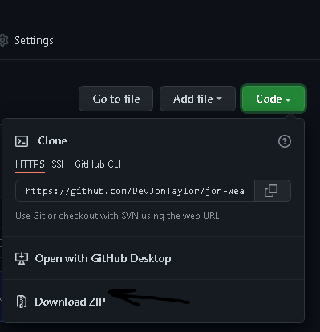

# Weather Forecast


I wanted to use some APIs to create a project and I had not used Bootstrap 5 yet.  So taking the chance to take Bootstrap 5 out for a spin as well as OpenWeatherMap's API seemed really amazing and fun to use.  I took an Object Oriented Programming (OOP) approach and created classes to perform my tasks.  These classes created endpoints and retrieved the data.  Once they have the data the next step was to render the HTML.  Then save search history to localStorage so we can come back to these results if the user wanted.  Bootstrap was nice to utilize and created a responsive UI while utilizing the screen space to the maximum.  I implemented a second API from Mapbox to provide a better user experience with autocomplete while they type out the location.  This worked out really well as it provides the GeoCodes and makes it easier to find the location they wanted, allowing us to utilize OpenWeatherMap's API to the its fullest!

## Goals
- [x] Weather conditions are presented by searched
- [x] Searched locations are added to a history to be reselected
- [x] Data presented is City name, date, icon representation of weather conditions, tempature, humidity, wind speeds, and UVI
- [x] UVI is highlighted based on favorable, moderate, or severe conditions
- [x] Provide a five day forecast conditions.
- [x] five day forecast provides date, icon conditions, temperature, wind speeds, and humidity
- [x] When history is reselected current and future conditions are shown.
- [x] History is saved to localStorage

## Demo
You can find a demo at [GitHub Pages](https://devjontaylor.github.io/jon-weather-forecast/).
## Deployment

The dependencies are for:
- [Bootstrap v5.1.3](https://getbootstrap.com/)
- [Mapbox v2.6.1](https://docs.mapbox.com/)  

A CDN is used so no direct installation or setup needed. You only need an internet connection when opening the page.

### Clone
You can clone the repo using the following command

```bash
git clone https://github.com/DevJonTaylor/jon-weather-forecast.git
```
### Download Zip

1. Go to GitHub [Repository](https://github.com/DevJonTaylor/jon-weather-forecast)
2. Click green Code button
3. Select download zip button at the bottom.





## Examples

### Search with Autocomplete


### Responsive Search and Weather


### Search History


## License

[MIT](./LICENSE)
